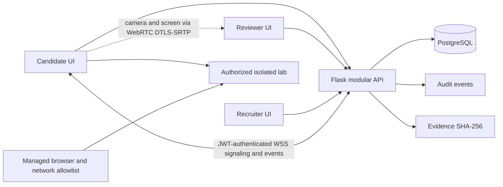

# Architecture

## System architecture

The MVP is a React/TypeScript single-page client and a modular Flask API backed by PostgreSQL. The front-end add-on views are a clearly labelled synthetic demo; the API implements persisted defense, evidence-based skill scoring, recruiter proof and interview flows.

## Frontend

Vite serves a responsive React/TypeScript client with role-specific workspaces, lab and handbook pages, finding/report flows, assessment interactions, reviewer queue, and synthetic recruiter discovery. Secure Assessment Mode is an additive React component inside the existing Candidate Assessments and Reviewer workspaces.

## Backend and database

SQLAlchemy models cover users, findings/submissions, interview invitations and audit events. Secure assessment sessions, allowed targets, global assessment policy, and event/acknowledgement records are additive models. PostgreSQL is configured through `DATABASE_URL`; SQLite is the zero-setup development default. The assessment answer keys are defined only in the API module.

Additive tables persist reviewer defense prompts and responses, server-scored assessment section results, and reviewer rubric metrics. Existing submission records and role model remain in place.

## Authentication and access control

The API uses password hashing, short-lived JWTs, role decorators, candidate-owned submission scoping, reviewer-only decisions and recruiter-only candidate discovery/invitation creation. Registration restricts the role to the three supported roles. Secure session APIs and Socket.IO/WebSocket signaling authenticate the JWT and authorize only the session's candidate and assigned reviewer.

Camera and display capture use explicit browser prompts after consent. WebRTC transports media peer-to-peer; the API stores status/events and relays only WebRTC signaling. No audio/video recording is persisted. STUN is configured by environment, with optional server-minted short-lived TURN REST credentials.

Allowed targets are reviewer-managed and copied into each session. This is a scope display and application workflow feature, not a network firewall. Real external-site restriction requires managed browser/kiosk policy plus DNS/proxy/firewall egress allowlisting. Browser JavaScript cannot lock down the operating system.

## Lab isolation

The UI exposes start/reset actions for a synthetic contained target but does not launch a Dockerized vulnerable target yet. Do not connect this demo to arbitrary hosts. Production lab execution needs per-session isolation, egress denial, resource limits, reset orchestration and monitoring.

## Finding flow

Candidate submits a complete finding and sanitized evidence. The API validates required fields, hashes evidence, flags duplicate evidence, and records a pending submission. A reviewer can record verified, rejected or needs-changes status and a bounded final score.

## Review flow

The queue presents finding context and an advisory example. Reviewers can request defense questions; candidates answer only their own submission prompts; reviewers score each answer. Human review controls the final status, finding score, defense score and report/evidence rubric dimensions. AI suggestions do not alter verification state.

## Security DNA and proof chain

The nine-skill fingerprint uses reviewer-verified findings, saved server-scored assessment sections, finding review scores, technical defense scores and a deterministic lab-difficulty signal. Each capability is returned separately from proof confidence. Confidence reflects verification volume, reviewer scores, report/evidence completeness, defense review and duplicate flags. No evidence means zero proof confidence for that skill. Finding accuracy is the verified-to-submitted ratio; rejected findings and duplicate/submission-rate events are surfaced for human inspection, never automatic bans.

Recruiter proof routes return only verified findings. Raw evidence is replaced by a sanitized summary and common credential/email patterns are redacted from text fields. Claimed tools are not included in verified-tool matches; tool verification requires future lab telemetry.

## Assessment flow

Four sections have exactly 10 questions each. Candidate question responses contain question text and options only; correct answer indexes stay server-side. The scoring endpoint accepts exactly 10 option indexes and returns the section result.

## Ranking and recruiter discovery

The UI illustrates threshold matching with labeled synthetic records and a “why matched” explanation. The API filters recruiter discovery by verified capability, proof confidence, finding accuracy and a specific evidence-backed skill. The API's profile endpoint returns a sanitized proof chain and match reasons. Interview invitations persist metadata and support candidate acceptance/decline.

## Anti-gaming and security

Rate limits, evidence hashes, duplicate flags, audit events, candidate ownership checks, role authorization, request-size limits and server-side assessment scoring provide basic protections. See [anti-gaming.md](anti-gaming.md) and [security.md](security.md).

## Adaptive challenges

The recommendation endpoint finds the weakest measured skill and maps it to an existing authorized lab. It does not alter scores or verification state.
